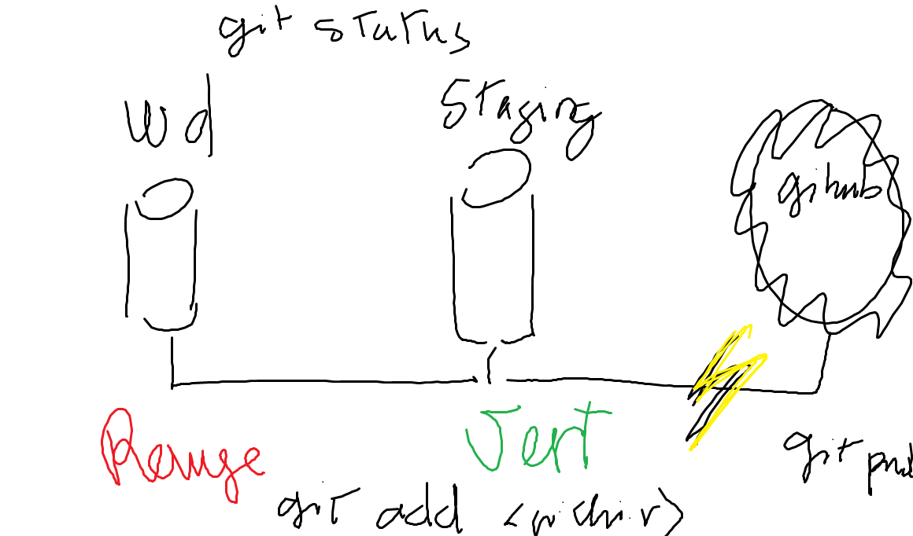

# Github

Créer votre compte sur https://github.com et veuillez fournir votre :id: github

Installer [git bash](https://github.com/CollegeBoreal/Tutoriels/tree/master/0.GIT) sur votre PC 

:pushpin: Les différents stades de l'évolution d'un fichier dans le monde `git` 

<image src="staging.png" width="580" height="340"></image>

# Participation

|:hash:| Boréal :id:| Nom, Prénoms .                       |  Github :id:                                          |
|------|------------|--------------------------------------|-------------------------------------------------------| 
|   01 |  300106677	| Decimus, `Leo`naldo	                 | [leonaldo1994](https://github.com/leonaldo1994)       | 	
|   02 |  300115064 | Mouahhidi, `Naoufal`                 | [Naoufal271](https://github.com/Naoufal271)           |
|   03 |  300115206 | Ntando, `Jojo` Ikusola               | [itonga](https://github.com/itonga)                   | 	 
|   04 |  300117791 | Wagoum Tchoupou, Don De `Misé`ricorde| [DonMise](https://github.com/DonMise)                 | 	 
|   05 |  300117811 | Cyrille, `Sio` Mahan a.k.a `Mh`      | [sio-mh](https://github.com/sio-mh)                   | 	
|   06 |  300121460 | Henry, Davidson a.k.a `Dave`         | [daveinfo20](https://github.com/daveinfo20)           | 	
|   07 |  300122014 | Bitja Makak, `Sylvain` Emmanuel      | [sylvainEmm](https://github.com/sylvainEmm)           |
|   08 |  300122131 | Ebengue, Steve                       | [emsed0](https://github.com/emsed0)                   |
|   09 |  300122501 | Kande, Abdourahamane                 | [abdourahamanekande](https://gitlab.com/abdourahamanekande) |	

Brice: L'informatique c'est magique :tada:

Leo:  j'aime le college boreal  : hallo: info

Sio: Viperes

Davidson:Ça marche maintenant.

salut
