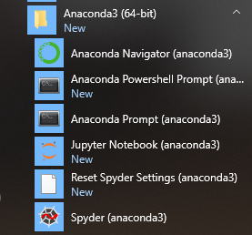
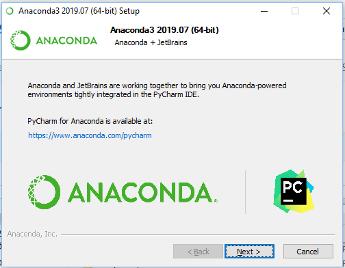

# Install


## Avec un [PackageManager](https://github.com/CollegeBoreal/Tutoriels/tree/master/G.PackageManager)

:apple: MacOS

```
$ brew cask install anaconda
```

:bulb: Windows

```
> choco install anaconda3
```


## Binaire

https://www.anaconda.com/distribution/


## Spyder




## PyCharm

https://www.anaconda.com/pycharm/


